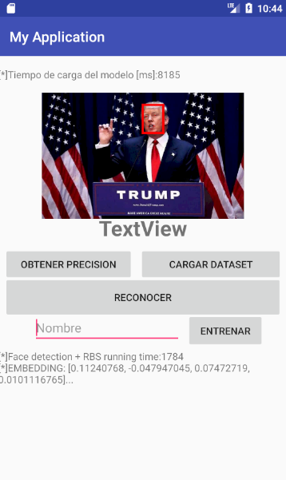
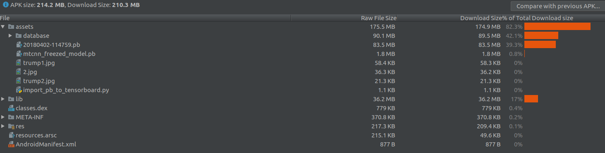

# APP PARA CONTROL DE ACCESO MEDIANTE RECONOCIMIENTO FACIAL LOCAL

Este proyecto tiene como objetivo la implementacion de una aplicacion para dispositivos Android cuya funcion es reemplazar la tarjeta de asistencia utilizada en faenas de construccion.

El proyecto se implementa como una rama del proyecto Android-Facenet: https://github.com/vcvycy/Android_Facenet

Dentro de la aplicacion se puede realizar tanto el enrolamiento como el reconocimiento de un individuo. Ademas los botones "CARGAR DATASET" y "OBTENER PRECISION" sirven para cargar un dataset especifico al clasificador y el segundo para validar el modelo mostrando al final de la ejecucion la precision obtenida por el modelo. Su ejemplo de uso se presenta a continuacion:

Para el reconocimiento facial se utiliza una red Facenet desarrollada por David Sandberg (https://github.com/davidsandberg/facenet) con el preentrenamiento 20180402-114759.

Enrolamiento:
La red genera un vector de caracteristicas o Embedding de 128 elementos para cada imagen que pasa por esta. Posteriormente este vector junto con su etiqueta se incorpora a un espacio multidimensional. Para cada individuo a enrolar se requieren cinco fotos las que son agregadas al espacio, de manera que una vez enrolados los individuos, en el espacio queda un cluster por persona.

Reconocimiento:
La imagen a reconocer pasa por la red para obtener su vecotr de caracteristicas, posteriormente se ubica este en el espacio. Al ubicarlo en el espacio se identifican los tres vectores mas cercanos dentro de una distancia euclideana de THRESHOLD = 0.9 y mediante votacion, la etiqueta mas repetida dentro de estos tres vectores se obtiene la prediccion de la imagen.

# MODO DE USO:

1. Instalacion: Existen dos alternativas, instalando el archivo APK del link (https://drive.google.com/file/d/1BFM6HsXAQTgkoPdRSx1mu-zSO-U3fJOP/view?usp=sharing) o clonando el proyecto y montandolo en un dispositivo virtual mediante Android Studio
2. Entrenamiento:   
        - Hacer Tap en la imagen en la parte superior y seleccionar imagen a enrolar.
        - Escribir la etiqueta de la persona en el campo bajo la foto
        - Presionar el boton ENTRENAR
3.  Reconocimiento:
        - Hacer Tap en la imagen en la parte superior y seleccionar imagen a reconocer.
        - Presionar RECONOCER
        - El nombre identificado aparece bajo la imagen
4. Cargar Dataset:
        - Presionar boton CARGAR DATASET
        - Probablemente el dispositivo se quede congelado al rededor de 5 a 10 minutos al momento de cargar el dataset.
        - No presionar nada hasta que bajo la imagen aparezca el mensaje "Dataset Cargado"
5. Obtener Precision:
        - Presionar boton OBTENER PRECISION
        - Probablemente el dispositivo se quede congelado al rededor de 5 a 10 minutos al momento de validar el modelo.
        - Al finalizar se muestra bajo la imagen la precision obtenida por el modelo
        
COMPOSICION DEL ARCHIVO APK:

